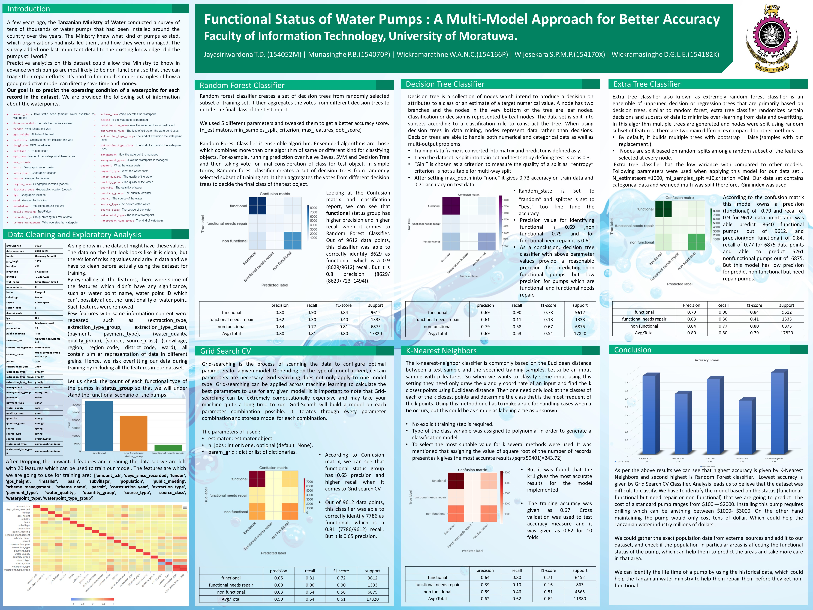
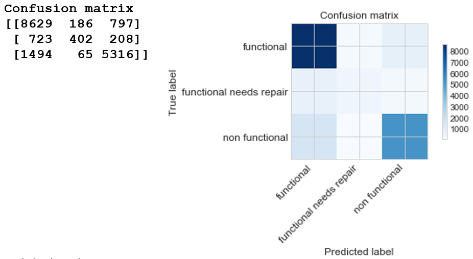

# Water Pump Failure Prediction in Tanzania
Prediction of maintanance needs for water pumps in Tanzania

## Overview
The African continent has a quarter of the world’s arable land, and the majority of the labour force is engaged in the agricultural sector. In sub-Saharan Africa, only 4 percent of arable land is irrigated, severely constraining agricultural productivity in a region where an estimated one third of the population is chronically undernourished. By comparison, 37 percent of arable land is irrigated in Asia, 24 percent in Northern Africa and 15 percent in Latin America. This structural imbalance contributes to wide-spread poverty and precarious food security leading to adverse malnutrition, health and eductaion outcomes for the populace.

## Problem Statement

Attribution:http://www.humanosphere.org/
The Rural Water Supply Network estimates that from a sample of 60,000 handpumps installed across sub-Saharan Africa every year, up to 40% of those in the region are not functional over a 20 year time period.[5] As with any new technology, the laudable focus on improving acces to water infrastructure also comes with a crisis of failure. A recent study concluded that the aggregated costs to stakeholders of rural water supply failure in Africa represent a lost investment in excess of $1.2 billion.[6]

## The dataset
The dataset was obtained through the a www.DrivenData.org data challenge competition and attributed to the Taarifa waterpoints dashboard, which aggregates data from the TMWI.

The dataset is comprised of over 60,000 observations and 42 features. The data was very noisy and incomplete with a number of important features riddled with null values. The majority of the variables are categorical, although we have a handful of numerical features, as well as a couple of temporal features.

## Results

